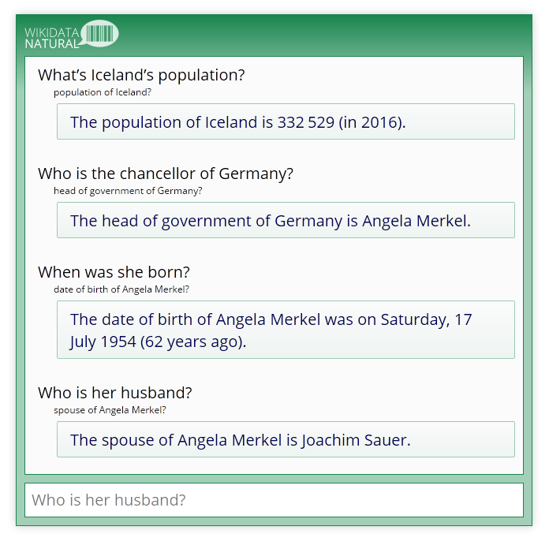

# Wikidata Natural

Conversational interface to [Wikidata](https://www.wikidata.org)’s structured information.

## Requirements

* [Node.js](https://nodejs.org/) 5+
* [Python](https://www.python.org/downloads/) 3+
* [Flask](http://flask.pocoo.org/)
* [SpaCy](https://spacy.io/docs#getting-started) with English Language Model
* npm libraries listed in package.json

## Instructions

Run the SpaCy server with ```python3 spacyServer/spacyServer.py``` and the main app with ```node app.js```.

Or both with ```npm start```.

In a browser, visit ```localhost:3000``` and ask some questions:


